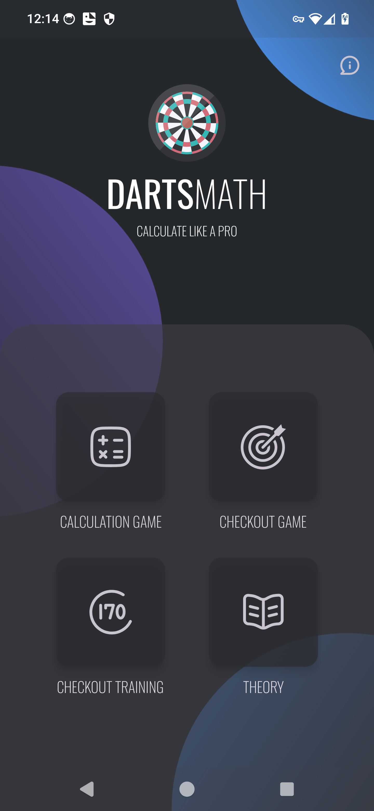
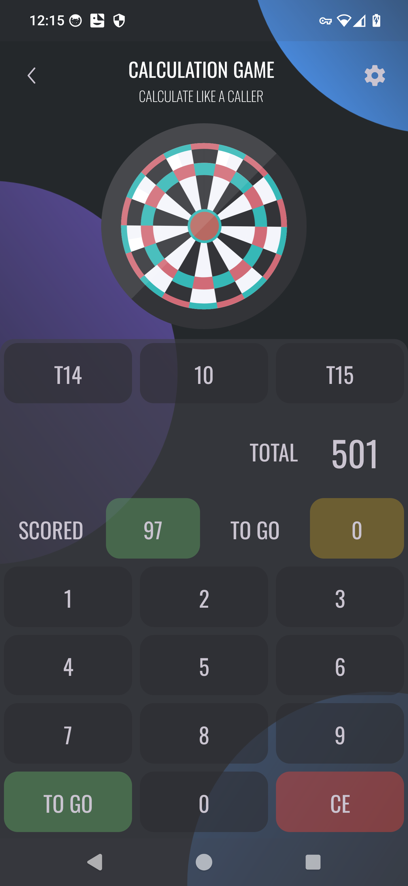
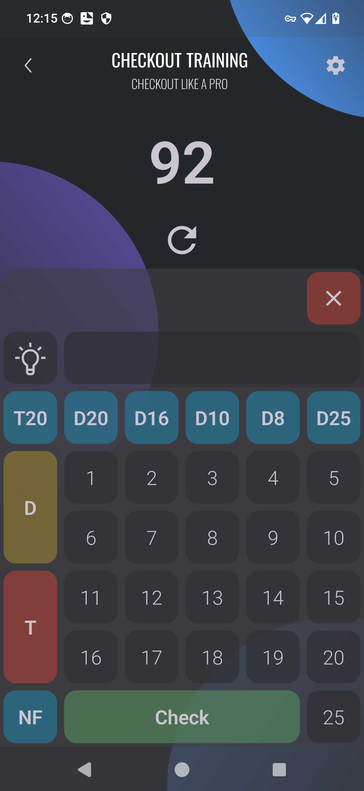

# DartsMath
With DartsMath you can learn to calculate dart scores like a pro

# Current Version
## 0.3.1-alpha (see [Changelog](CHANGELOG.md))

# Milestones
* 01/03/24 - 0.4.0 - Add Checkout Game
* 01/04/24 - 0.5.0 - Add Theory Section
* 01/05/24 - 0.6.0 - Play Store pre-release, Closed testing
* 01/06/24 - 0.7.0 - Play Store pre-release, Internal testing
* 01/08/24 - 1.0.0 - Play Store Production release

# Features
- Calculation Game
- Checkout Game
- Checkout Training
- Darts Math Theory

Startscreen                |  Calculation Game |  Checkout Training
:-------------------------:|:-------------------------:|:-------------------------:
   |  |  
